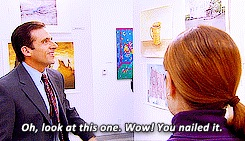
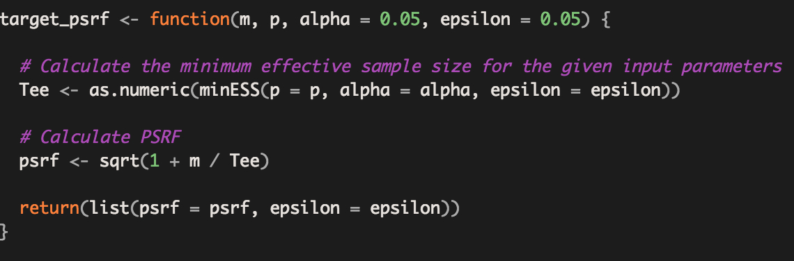
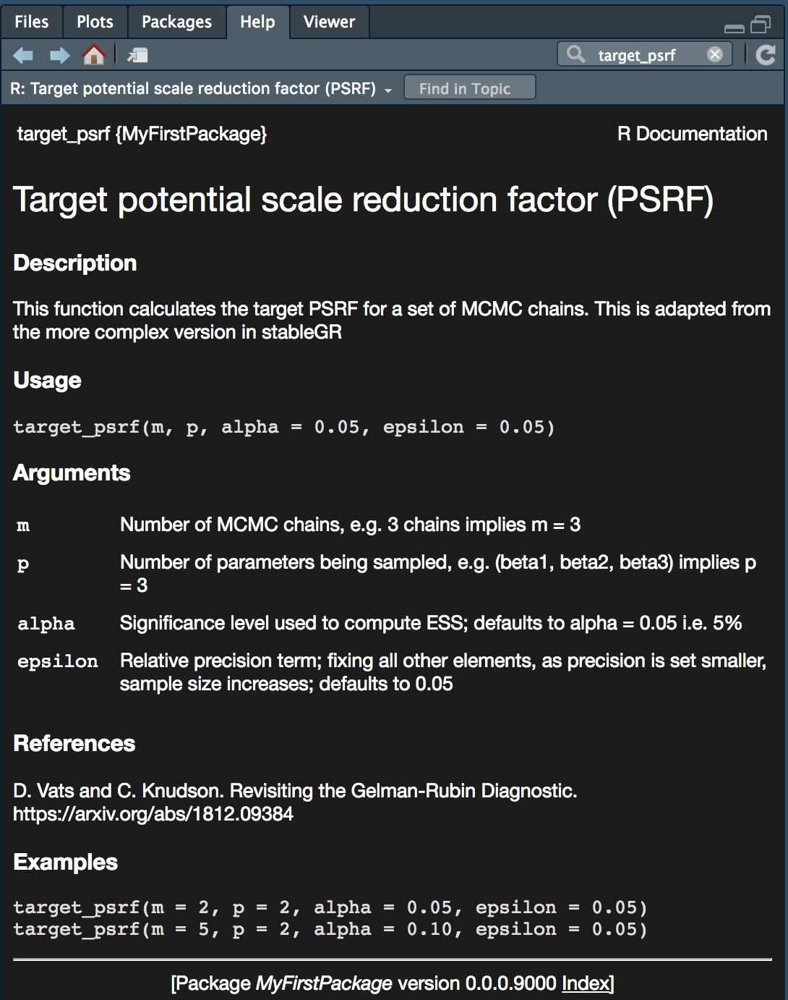
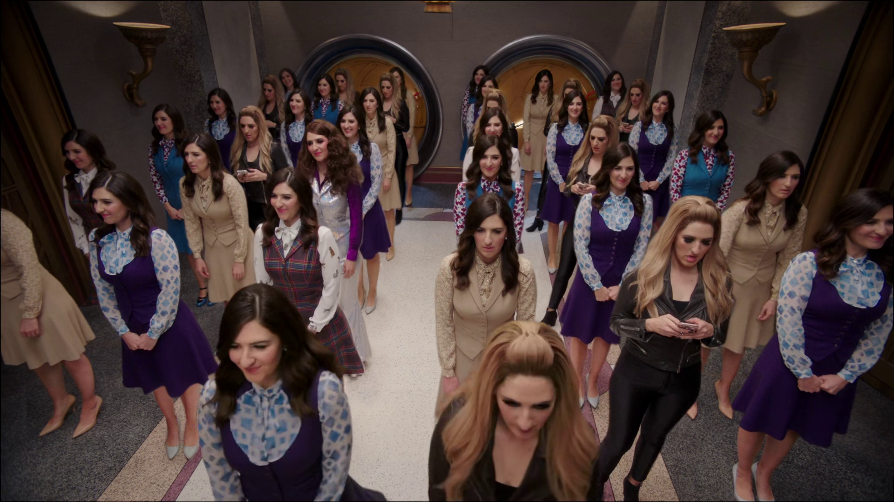
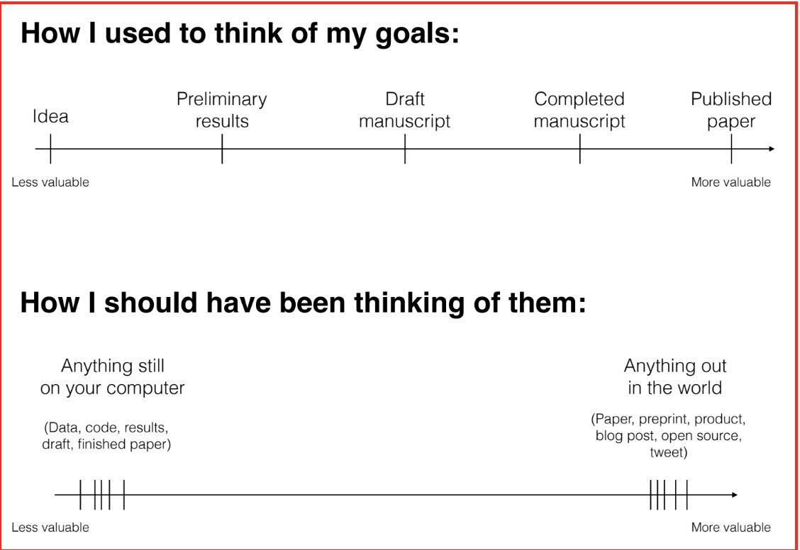

```{r, include = FALSE}
knitr::opts_chunk$set(
  echo = TRUE,
  collapse = TRUE,
  comment = "#>"
)
```

## Dr. Dietz's Disclaimer
The views expressed in this presentation are strictly my own. They do not necessarily represent the position of the Federal Reserve Bank of Minneapolis or the Federal Reserve System.

## About Us

 - Friends since meeting in our Statistics PhD program in 2011
 - Co-organizers of R Ladies-Twin Cities and the noRth conference
 - Both cyclists & coffee lovers
 
```{r ldck, echo=FALSE, out.width = '50%', fig.align='center'}
knitr::include_graphics("pics/ldck.jpg")
```

## Objectives of this talk

```{r setup, message=FALSE, eval=FALSE}
library(MyFirstPackage)

# Design your R package
design_package()

# Build your R package
build_package()

# Distribute your R package
distribute_package()

#Profit!
```

## Our Assumptions

 - You have some experience programming in R
 - You have some experience on Git (i.e. we won't show you how to set it up) 
 - You have some custom R functions on your computer that get used repeatedly
 - You have an audience (including yourself) for your code

## Best practices for R package design

```{r pam, echo=FALSE, out.width = '100%'}

```

## What is a design document?

 - A blueprint or recipe for your project with plenty of details
 - Doc written with the understanding that future-you will forget these details otherwise

## Why use a design document? (1 of 5)
 - [Watch this video first!](https://www.youtube.com/watch?v=NywzrUJnmTo)
 
## Why use a design document? (2 of 5)

 - Separates thinking and coding
 
```{r , echo=FALSE, out.width = '100%'}
knitr::include_graphics("pics/twoseparate.jpg")
```

 Imagine creating enchiladas without a recipe!

## Why use a design document? (3 of 5)

 - Forces you to explain everything in detail 
 - Helps you predict problems and tricky points 

```{r , echo=FALSE, out.width = '100%'}
knitr::include_graphics("pics/FoldItIn.jpg")
```
 
## Why use a design document? (4 of 5)

 - Helps you divide the work into reasonable modules so you can split it between days or people and make sure it it will come together seamlessly

```{r , echo=FALSE, out.width = '50%'}
knitr::include_graphics("pics/LadleStir.jpg")
```
 
 No need to ladle and stir at the same time.

 
## Why use a design document? (5 of 5)
 
 - Helps future you/developers understand what you had done so that you can create improvements or additions
 - Helps you remember everything you'll inevitably forget
 
```{r , echo=FALSE, out.width = '100%'}
knitr::include_graphics("pics/BurningSmellsLike.jpg")
```

## What to include in your design document
 - Goal of each function
 - Inputs and outputs of each
 - Flow chart between functions
 - Calculations/equations
 - Any tricky points
 - Numerical stability considerations 
 - How you will approach each function (and some pseudo code)
 - Tests you will implement (again goals, details)
 - Helpful sketches
 - Major updates
 - Things you want to add/change in the future
 
## Examples of Design Docs

- [glmm](https://github.com/knudson1/glmm/blob/master/DesignDocs/DesignDocGLMM.pdf) 
- [stableGR](https://github.com/knudson1/stableGR/blob/master/DesignDoc/Revisiting_GR.pdf)


## Building An R Package 

 - You have the building blocks 
   + Repeatable processes 
   + Custom functions
   + Design document 

```{r lego1, echo=FALSE, out.width = '100%'}
knitr::include_graphics("pics/lego.jpeg")
```

## Create the Package

 - Building R packages used to take expert knowledge. Not anymore!
 - Several R packages and RStudio built-ins exist to help you

 - Option #1 - Use the RStudio interface: File -> New Project -> New Directory -> R Package

 - Option #2 - Use the aptly named `usethis` package
```{r setup3, eval=FALSE, message=FALSE}
#install.packages('usethis')
library(usethis)

usethis::create_package("~/MyFirstPackage") 

```

## Add files for your functions

 - Option #1 - Create .R files with your function and move them into the package's R folder
 - Option #2 - `usethis` package
 
```{r setup4, eval=FALSE, message=FALSE}

usethis::use_r('target_psrf')
usethis::use_r('minESS')

```

If R functions are new to you, check out this resource: https://r4ds.had.co.nz/functions.html

## Create (or copy/paste) functions

```{r miness, echo=FALSE, out.width = '100%'}

```

## Add help documentation for functions 

 - In an R package, help documentation is mandatory; good documentation is optional (but not really!)
 - While you can create documents manually (in the man folder), the `roxygen2` package makes it easy to create the documentation with your code
```{r miness2, echo=FALSE, out.width = '100%'}
knitr::include_graphics("pics/fullfunc.jpeg")
```

## Help documentation generated by `roxygen2`

```{r doc, echo=FALSE, out.width = '75%'}

```

## Check, build, and install your package

Option #1 Use the tools in RStudio
```{r build, echo=FALSE, out.width = '80%'}
knitr::include_graphics("pics/check.jpg")
```

Option #2 Use the `devtools` package (can be useful when things get more complicated)
```{r check, eval = FALSE, echo=TRUE}
devtools::check()
devtools::build()
devtools::install()
```

## Customize

- Add tests, package dependencies, vignettes!
- A comprehensive R package building resource: https://r-pkgs.org/index.html

```{r bedazzle, echo=FALSE, out.width = '100%'}
knitr::include_graphics("pics/bedazzler.jpg")
```

## Distribution of Your R Package

```{r janet, echo=FALSE, out.width = '100%'}

```

## Why Distribute Your R Package?

```{r dr, echo=FALSE, out.width = '90%'}

```

From David Robinson's excellent talk at rstudio::conf(2019) (https://rstudio.com/resources/rstudioconf-2019/the-unreasonable-effectiveness-of-public-work/)

## Why Distribute Your R Package?

- Gains in usership/citations for those in the public domain (academics, nonprofits)
- Gains in productivity for those in private industries
- Saving "future you" time with third parties such as audit
- You control the narrative of your code

## Distibution in Git

 - Git has become a dominant version control technique 
 - Git makes it easy to (1) track changes over time (2) plan future changes (3) work with teams
 - Git is well integrated into RStudio
 
```{r organized, echo=FALSE, out.width = '100%'}
knitr::include_graphics("pics/ann.jpg")
```

## Git Jargon

 - Git has A LOT of jargon. Don't let it overwhelm you and ask questions of those who use it as a second language. (https://git-scm.com/docs)
 - Some start-up words: 
   + repository - a remote folder for your things on your Git site of choice (Github, GitLab, etc.)
   + clone - make a copy of your remote repository on your computer
   + pull - incorporate changes from a remote repository into your local clone
   + commit - record changes to your local clone
   + push - update remote repository with changes from your commits
 - An amazing and free resource for R users is Jenny Brian's book: https://happygitwithr.com/


## The Beginning

 - Thanks for being here and to the WiADS organizers for making a great conference happen
 - We hope we've planted the seeds for you to build R packages to showcase your work going forward
 
 ```{r incepted, echo=FALSE, out.width = '100%'}
knitr::include_graphics("pics/inception.jpg")
```

